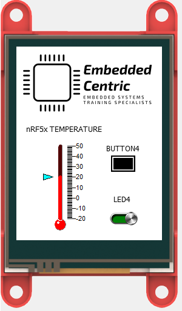
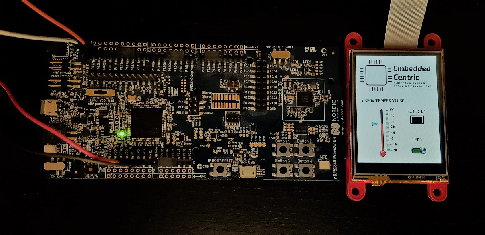
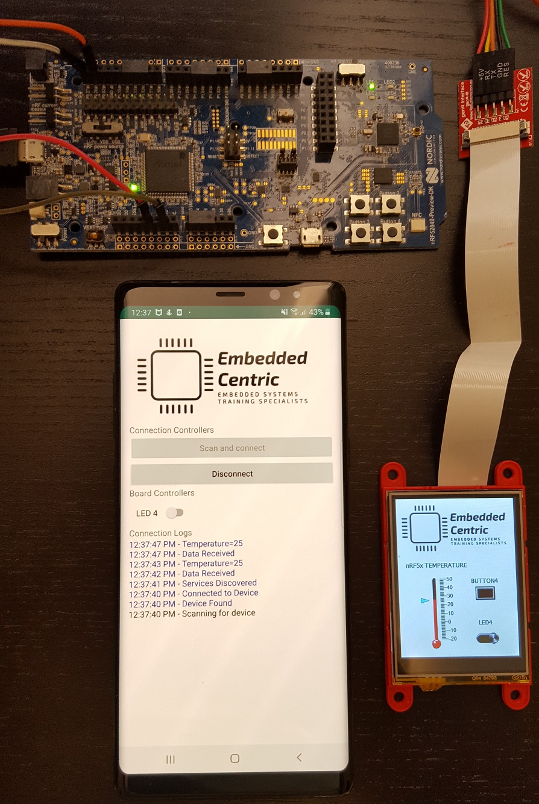

# nRF52840 DK Touch Screen Demo 1 

### Description
A simple demo program that utilizes the nRF52840 DK by Nordic Semiconductor, and gen4-uLCD-24PT touch screen by 4D Systems. [YouTube Video](https://www.youtube.com/watch?v=fjvI9cyMpDY).

The demo supports the following functionalities: 
1. Control LED4 on the nRF52840 DK through both the touch screen and over Bluetooth Low Energy (BLE).
2. Get the status of Button 4 on the nRF52840 DK through both the touch screen and over BLE.
3. Read the nRF52840 on-chip tempreture sensor through both the touch screen and over BLE.

The demo has a custom made Android App [nRF5TouchScreenDemo1](https://github.com/EmbeddedCentric/nRF5-TouchScreen-Demo1-Android-App) to interact with the nRF52840 board over BLE, However, nRF Connect available for both iOS and Android could also be used here.
The demo creates a NUS BLE service. NUS stands for Nordic UART service.
NUS sets up a BLE datachannel through one "RX" characteristic with "write" properties, and one "TX" characteristic with "notify" properties, to fit the basic communication needs of this demo.
The LED4 is controlled through the RX characteristic. Writing (0x46 == ON) and (0x4F == OFF).
When notification is enabled on the TX characteristic, pressing Button 4 will send the string "Button 4 Pressed". In addition, the tempreture of the nRF5 chip is sent over the TX characteristics every TEMP_RADING_INTERVAL period.

In parallel to BLE, the touch screen is setup to achieve the same functionalities of controlling the LED, reading the status of Button 4, and the on-chip temperature.

### Hardware needed
1. nRF52840-DK ( Similar nRF5x boards can be used with minor modification).
2. gen4-uLCD-24PT touch screen.
3. gen4-IB (Interface Board) to convert the 30-way touch screen FFC cable to 4-wire serial. It comes with gen4-uLCD-24PT package.
4. Four wires. 

Interface to the touch screen is serial following the Genie Standard Protocol.

Touch Screen Side -> nRF52840 DK Side

LCD RX -> p0.27

LCD TX -> p0.26

V5+ -> 5V ( Recommended to be powered externally)

GND -> GND( Recommended to be powered externally)

### Important notes:

* Segger Embedded Studio V4.12(or above) is needed to build this demo. nRF5 SDK 15.2.0 (or above) is also needed.

* Double check that the nRF5SDK global macro is pointing to the right location where the nRF5 SDK is downloaded on your local disk. This can be done by checking Tools Menu -> Options -> Building -> Global Macros (nRF5SDK) and compare it to the root directory where the nRF5 SDK is downloaded.

* This demo is part of Nordic nRF5x BLE In-Depth Training Course -Intermediate Level ( Optional extracurricular activity after lesson 12) by [EmbeddedCentric](http://embeddedcentric.com) .

* More information can be obtained from [EmbeddedCentric](http://embeddedcentric.com) .

